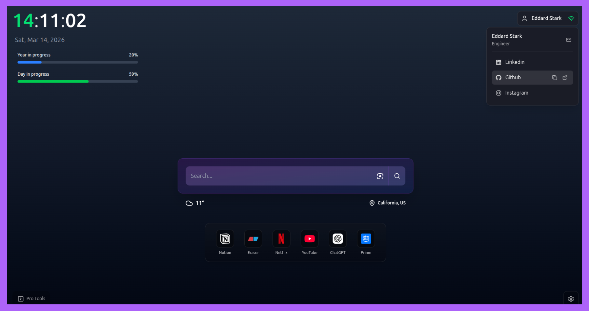

# TabQuest: Open Source Browser Extension

TabQuest is a productivity-focused **Open Source Browser Extension** designed to help you manage bookmarks, tasks, and notes with a clean and customizable interface.

[](https://opensource.org/licenses/MIT)

<div align="center">
  
</div>

## Getting Started

First, install dependencies:
```bash
  pnpm install
```

To start the development server:
```bash
  pnpm dev
```

## Build

To create a production build for Chrome, Firefox, or Edge:

```bash
  pnpm build
```

Individual platform builds:
```bash
  pnpm build:chrome
  pnpm build:firefox_edge
```

## Features

- <b>Bookmarks Management</b>: Save, organize, and search bookmarks effortlessly.

- <b>Tasks (Todos)</b>: Keep track of your to-dos with a simple and intuitive interface.

- <b>Notes and Code Snippets</b>: Create and search notes, with support for code snippets.

- <b>Customizable Home Page</b>: Personalize your home page for quick access to your favorite sites and social media.

- <b>Clean, Professional UI</b>: Enjoy a consistent and visually appealing interface.

## Tech Stack

**Client:** React, Redux, TailwindCSS, Vite, Framer-motion
**Backend (Val Town):** [Weather API](https://www.val.town/x/TabQuest/weatherAPI)

## External APIs

TabQuest leverages public and custom APIs to provide dynamic features:
- **Weather API**: Powered by a custom [Val Town](https://www.val.town/x/TabQuest/weatherAPI) endpoint that aggregates weather data. The backend code is open-source and unlisted for transparency.
- **Favicon Service**: Uses Google's S2 favicon service for bookmark icons.
- **Feedback**: Integrated via a custom Google Apps Script.

## Contributing

Please read our [Contributing Guide](CONTRIBUTING.md) and [Code of Conduct](CODE_OF_CONDUCT.md) to learn how you can help!

## License

This project is licensed under the [MIT License](LICENSE).
